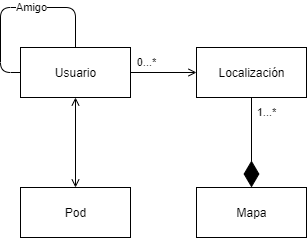

[[section-concepts]]
== Conceptos transversales
En esta sección se tratarán los conceptos transversales inherentes al proyecto, describiendo las principales normativas generales y las ideas de soluciones que son relevantes en múltiples partes del sistema.

image::../images/mindmap.jpg["Mapa mental sobre los conceptos transversales del proyecto"]

=== Conceptos del dominio
Se trata de un modelo conceptual que abarca todas las cuestiones del dominio del problema desde el nivel más abstracto posible:

=== Patrones de arquitectura y diseño
Se estima que el patrón MVC será el utilizado para el desarrollo web de la aplicación, aunque por el momento se está discutiendo.

Por otro lado, el sistema móvil hará uso de la web y no se desarrollará una aplicación individual por el coste de tiempo que tendría.

=== Experiencia de usuario
La aplicación es un sistema de gestión de amigos y localizaciones, destinado a acercar a las personas. Mostrará un mapa donde se podrá observar los amigos que se encuentran cerca del usuario y permitirá añadir amigos para poder interactuar con ellos, entre otras funciones que se irán implementando como gestionar tus amistades, comunicarse con ellas, etc.

La interfaz desarrollada será amigable y accesible a cualquier persona, evitando que un cliente no pueda usar nuestra aplicación.

=== Seguridad y protección
Es de vital importancia que la aplicación sea segura en todo momento, almacenando correctamente los datos necesarios del usuario final.

Hará uso de pods siguiendo el proyecto SOLID donde cada usuario será el propietario del mismo, teniendo total control sobre sus datos. Los únicos datos que se tratará directamente la aplicación será la localización del cliente previa aprovación por su parte.